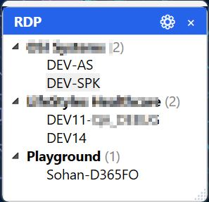
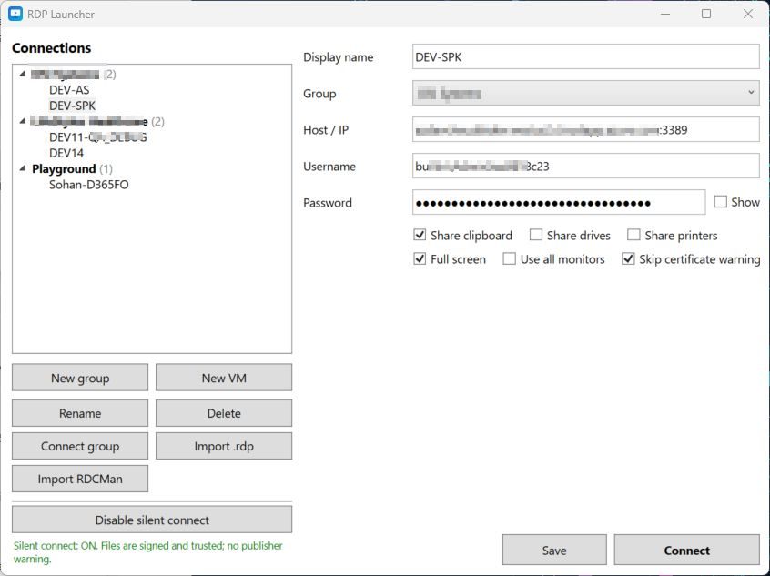
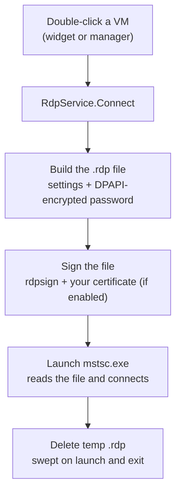
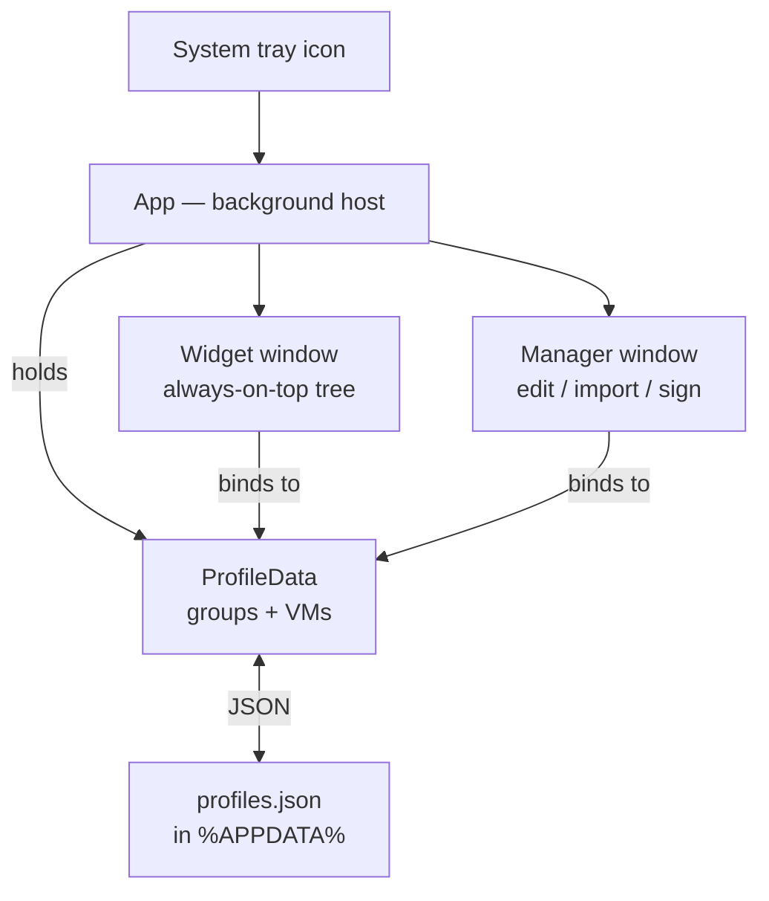

# RDP Launcher

A small, portable Windows utility for managing and launching RDP sessions. It
runs in the system tray with an always-on-top widget showing just your
connections tree — double-click a VM and you're in. No more double-clicking
`.rdp` files, choosing "Use a different account," and pasting credentials from
Notepad.


## Download

[Download latest release](https://github.com/sohankanti17/rdp_launcher/releases/latest)

> **Why it exists:** connecting to a VM the normal way means a `.rdp` double-click,
> a clipboard prompt, "More choices → Use a different account," and a paste from
> wherever you keep credentials — every single time. RDP Launcher collapses all
> of that into one click.

---

## Screenshots

### Desktop widget
The always-on-top panel that sits on your desktop, grouped by connection group.



### Manager window
The main window for managing connections, credentials, and settings.



---

## Features

- **One-click connect** — credentials and settings are embedded into a generated
  `.rdp`; native `mstsc` launches with no popups.
- **System-tray background app** with an always-on-top **desktop widget** showing
  only the connections tree. Double-click a VM to connect.
- **RDCMan-style groups** — organize VMs into named groups in a tree.
- **Import** from RDCMan `.rdg` files and plain `.rdp` files.
- **Encrypted credentials** — passwords are stored with Windows DPAPI (current
  user). Nothing is kept in plaintext.
- **True full-screen + multi-monitor** — full-screen sessions route Alt+Tab and
  the Windows key to the remote machine.
- **Silent connect** — optional one-time setup that signs generated `.rdp` files
  so Windows' "Unknown publisher" warning never appears.
- **Portable** — a single self-contained `.exe`, or a small framework-dependent
  build. No PowerShell, no console windows.
- **Copy credentials** — right-click any VM in the widget to copy Host, Username,
  and Password to clipboard for quick sharing with your team.
- **Expand / collapse all groups** — toggle button in the widget header to collapse
  or expand all groups at once.

---

## How it works

The whole design rests on one fact: `mstsc` (the Windows RDP client) can read
**everything** it needs from a `.rdp` file — host, username, password, clipboard
sharing, screen mode. So instead of automating dialog clicks, the app writes a
temporary `.rdp` with all of that baked in and launches `mstsc` pointed at it.
Nothing has to be prompted, because nothing is missing.



The password is embedded in the exact format `mstsc` expects: the hex of the
DPAPI-protected UTF-16 bytes (`password 51:b:<hex>`). Because DPAPI is scoped to
your Windows account, that blob is useless on any other machine — which is also
why imported passwords never carry over.

### Architecture

The app is a tray-resident background process. One `ProfileData` instance is the
single source of truth; both windows bind their tree to it, so an edit in the
manager shows up in the widget immediately.



---

## Getting started

### Requirements

- Windows 10 / 11 (x64)
- [.NET 8 SDK](https://dotnet.microsoft.com/download/dotnet/8.0) to build

> WPF builds on Windows only — this project cannot be compiled on Linux or macOS.

### Build

From the project folder:

```powershell
# Portable, self-contained — nothing to install on target machines (~150 MB exe)
dotnet publish -c Release

# Same, but compressed (~60-70 MB; decompresses on first launch)
dotnet publish -c Release -p:EnableCompressionInSingleFile=true

# Small framework-dependent exe (~5 MB) — needs the .NET 8 Desktop Runtime
dotnet publish -c Release --self-contained false
```

The result is in the **publish** subfolder (the exe one level up is a stub that
needs all the DLLs — don't copy that one):

```
bin\Release\net8.0-windows\win-x64\publish\RdpLauncher.exe
```

When you move the exe to another machine you may need: right-click → Properties →
**Unblock** (it's self-built and unsigned, so SmartScreen flags it once).

### Run

Launch `RdpLauncher.exe` as your **normal user** (not as admin). It goes to the
tray — nothing in the taskbar — and shows the widget.

To start it at logon, drop a shortcut in your Startup folder (`Win+R` →
`shell:startup`).

---

## Usage

### The widget

A narrow always-on-top panel, docked to the right edge by default, showing only
the connections tree.

- **Double-click a VM** → connect.
- Drag the blue header to move it; drag the bottom-right grip to resize. Position
  and size are remembered.
- Header **gear** opens the manager; header **×** hides the widget to the tray.
- Right-click a VM for Connect / Open manager / Hide.

### The tray icon

- Double-click → show / hide the widget.
- Right-click → **Open manager**, **Show / hide widget**, **Exit** (Exit is the
  only thing that fully closes the app).

### The manager

Open it from the widget gear or the tray. Here you build the tree and edit VMs:

- **New group**, **New VM**, **Rename**, **Delete**, **Connect group** (opens
  every VM in a group), and a **Group** dropdown to move a VM between groups.
- Per VM: host (FQDN or IP, optional `:port`), username, password, clipboard /
  drive / printer sharing, **Full screen**, **Use all monitors**, and **Skip
  certificate warning** (for dev VMs with self-signed certs).

---

## Importing

- **Import .rdp** — pick one or many files; host, name, username, and redirection
  settings come across.
- **Import RDCMan** — pick one or many `.rdg` files; groups are recreated (nested
  groups flattened to `Parent / Child`), with usernames resolved from server,
  group, file, and named credential profiles.

> **Passwords are never imported.** In both formats the stored password is a
> DPAPI blob locked to the original author's Windows account, so it can't work on
> anyone else's machine. Set passwords once after importing. Re-importing skips
> VMs already present in a group (matched by host).

---

## Silent connect

Windows' April 2026 security update shows a "Caution: Unknown remote connection"
dialog for unsigned `.rdp` files and ignores their redirection settings. To
remove it cleanly, click **Enable silent connect** in the manager once and accept
the UAC prompt. It:

1. creates a self-signed code-signing certificate (`CN=RDP Launcher Signing`),
2. trusts it (Trusted Root + Trusted Publishers, current user), and
3. registers its thumbprint under
   `HKLM\SOFTWARE\Policies\Microsoft\Windows NT\Terminal Services\TrustedCertThumbprints`.

Every generated `.rdp` is then signed with `rdpsign`, so it opens with no warning
and no further admin prompts. Only files signed by **your** certificate are
trusted, so unexpected `.rdp` files (e.g. from email) still get the full warning.
**Disable silent connect** reverses all of it. Each user runs this once on their
own machine.

---

## Data & security

- Connections live in `%APPDATA%\RdpLauncher\profiles.json`; the widget's position
  in `widget.json`.
- Passwords are encrypted with Windows DPAPI (current-user scope) — never
  plaintext, and useless on any other machine or account.
- This is a convenience tool, not a hardened vault: anyone already logged in as
  you on your machine can have the app decrypt the passwords. Treat it like saved
  credentials in any RDP client.

---

## Distributing to a team

For a small framework-dependent build, the missing-runtime experience is handled
by .NET itself: opening the exe without the runtime shows a dialog naming the
required **.NET 8 Desktop Runtime** with a download link.

For a fully automatic install (detects the runtime, installs it silently if
missing, then installs the app with shortcuts), an [Inno Setup](https://jrsoftware.org/isinfo.php)
script is included as `RdpLauncher.iss`:

```powershell
dotnet publish -c Release --self-contained false
iscc RdpLauncher.iss      # produces RdpLauncherSetup.exe
```

---

## Project structure

| File | Responsibility |
| --- | --- |
| `App.xaml` / `App.xaml.cs` | Entry point, tray icon, single-instance, background lifetime, elevated setup branches |
| `MainWindow.xaml` / `.cs` | The manager: tree, group/VM editing, importing, silent-connect toggle |
| `WidgetWindow.xaml` / `.cs` | The slim always-on-top desktop widget (tree only) |
| `RdpService.cs` | Builds the temp `.rdp`, signs it, launches `mstsc`, cleans up |
| `Crypto.cs` | DPAPI helpers (storage encoding + the `mstsc` password format) |
| `SigningService.cs` | Self-signed cert creation, trust stores, registry, signing |
| `ImportService.cs` | `.rdp` and RDCMan `.rdg` parsers |
| `ProfileStore.cs` / `ProfileData.cs` | JSON persistence and the data container |
| `Profile.cs` / `Group.cs` / `NotifyBase.cs` | Data model + change notification |
| `SettingsStore.cs` | Widget position/size persistence |
| `Prompt.cs` | Minimal code-built input dialog |
| `RdpLauncher.iss` | Optional Inno Setup installer |

---

## Changelog

### v1.1.0
**Features**
- **Copy credentials** — Right-click a VM in the widget to copy Host, Username, and Password to clipboard, ready to share with your team.
- **Toggle expand/collapse** — ▼/▶ button in the widget header collapses or expands all groups at once.

**Bug fixes**
- **Group change crash** — Changing a VM's group in the Manager and saving no longer crashes the app.
- **Widget restore button** — ↻ button in the widget header resets the widget to its default size and position, fixing the multi-monitor shrink issue.

### v1.0.0
- Initial release.

---

## Roadmap ideas

- Auto-collapse the widget to a thin strip until hovered
- Per-VM connection notes / tags
- Optional `keyboardhook` toggle for windowed key passthrough
- Signed release builds to avoid the SmartScreen prompt

---

## Contributing

Issues and pull requests are welcome. Build with the .NET 8 SDK on Windows and
test against a real VM before submitting — most logic touches Windows-only APIs
(DPAPI, the certificate stores, `rdpsign`, `mstsc`).

---

## License

MIT — see [LICENSE](LICENSE).
